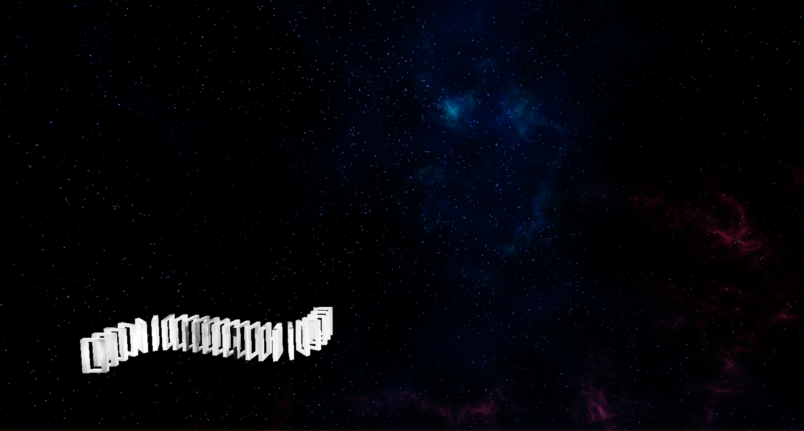

# IllusionCurve

A game about delusion of senses.
#
This game contains illusions and visual tricks.

The goal is to find the way to the end.

You can move with WASD keys and pause with Esc.
 
## How to launch

The game is currently only available on a Windows 64-bit OS. However, most of the time 32-bit Windows is fine as well. To play the game, simply click on

`⬇ Code > Download ZIP`

Alternative download source [here](https://simonyi-my.sharepoint.com/:u:/g/personal/lyaflora_sch_bme_hu/ER4Gtm6u8cNEiwH4R4kpHAkBitEvFuKNsbxedW-Rgs2c8g?e=DEiTAT).

After downloading, you should be able to unzip and launch the IllusionCurve-main/WindowsNoEditor/Illusion.exe file.
## Thank you for playing!
Creators:

© Pintér Adrienn, Tobai Botond István - 3D modeling, conception

© Petrók Flóra - Game development

[Link to background music](https://youtu.be/s57ZUkVh0NQ)

## In case of errors
If an error with message starting like "Failed to open descriptor file" comes up, please navigate to [IllusionCurve/WindowsNoEditor/Illusion/Content/Paks/Illusion-WindowsNoEditor.pak](https://github.com/lyaflora/IllusionCurve/blob/main/WindowsNoEditor/Illusion/Content/Paks/Illusion-WindowsNoEditor.pak) here in the github repository, and press `Download`. Then replace the exisiting file on your PC in the same folder (IllusionCurve-main/WindowsNoEditor/Illusion/Content/Paks) with the downloaded file (Illusion-WindowsNoEditor.pak). It should start without complications now.

If errors still occur, I recommend downloading the zip from the alternative source given above.